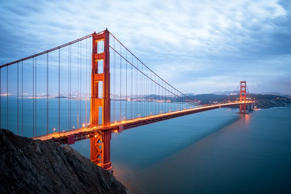
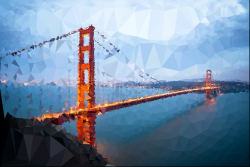
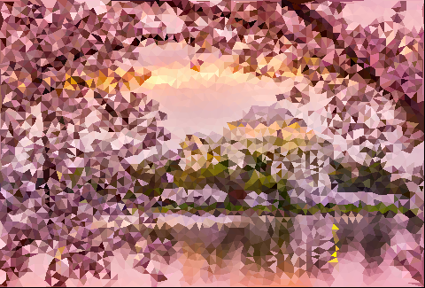
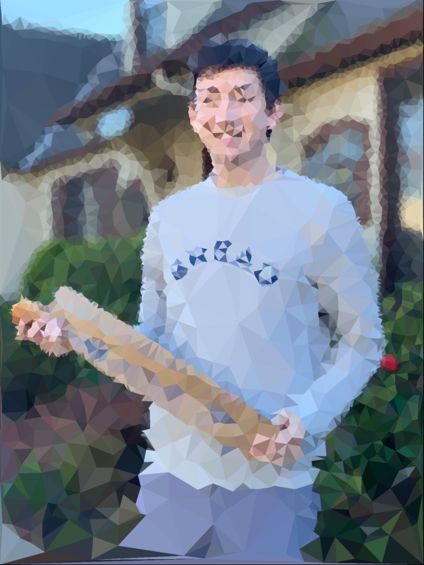
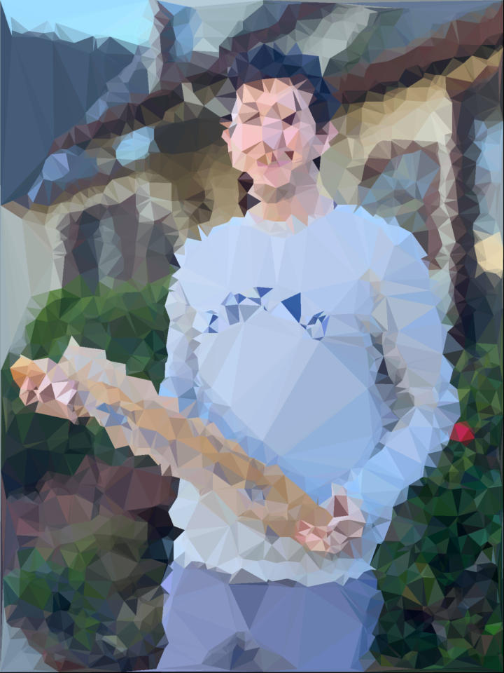
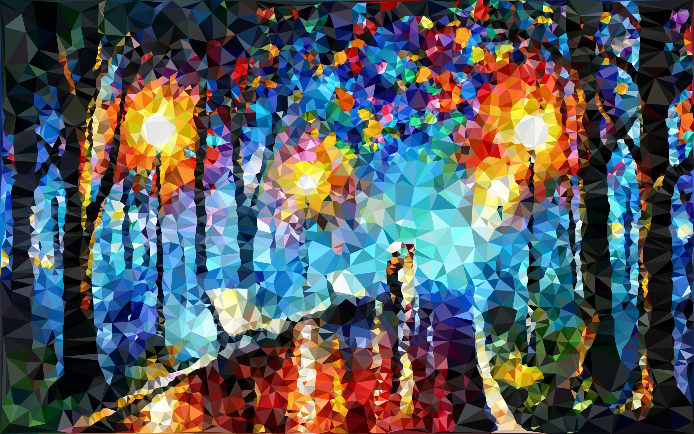
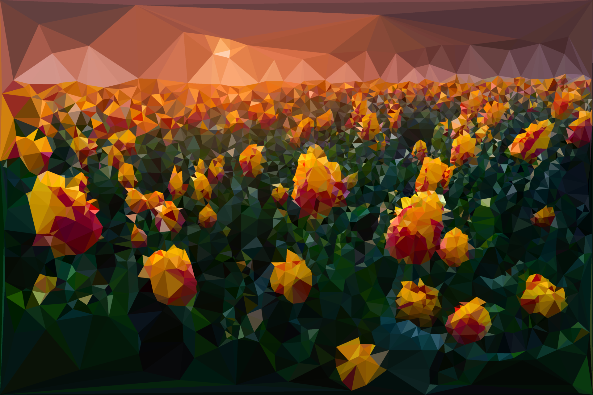

# PyTri : Python Image Triangulation
This project uses python scientific computing libraries to recreate an image using triangles.

The underlying script has options for approximate-canny or entropy-scharr edge detection, threshold or poisson-disk sampling, and mesh color based on triangle mean or centroid.

## Requirements and Installation
Simply run `$ pip install -r requirements.txt` to install the relevant python libraries to get started!

The project was built and tested using `Python 3.7` and the depedencies in `requirements.txt`. While the script may execute in other versions of python, it is not recommended.

The main dependencies are:
- **argparse:** used to interpret command line arguments and provide flexible program execution.
- **numpy:** used for general-purpose numerical computation and matrix manipulation.
- **matplotlib:** used for image plotting and windowed-rendering.
- **scipy:** used for scientific computation methods, such as the Delaunay operation that creates a triangular mesh from a given set of points.
- **scikit-image:** specific library built from `scipy` for image progressing subroutines.

## Usage
The main script for executing the project is `delaunay.py`, whose arguments are described in detail below.

By default, the output of the script is simply a side-by-side `imview` of the original image with it's triangulated counterpart. Use the `--save` flag below to save the output of a given run and `--seed` to reproduce results using the same random seed.

_Note_: Program execution time is highly dependent on input arguments. Threshold sampling is nearly instantaneous, while poisson-disk sampling calculates `~25-50px/s`. When triangulating a large file the script can take upwards of 5 minutes to execute, and this is to be expected. Probably some optimization should be done `¯\_(ツ)_/¯`

```
usage: delaunay.py [-h] [-sample {disk,threshold}]
                   [-process {approx-canny,edge-entropy}]
                   [-color {centroid,mean}] [-fill {wire,solid}] [-rate RATE]
                   [-blur BLUR] [-threshold THRESHOLD]
                   [-max-points MAX_POINTS] [-seed SEED]
                   [-save-name SAVE_NAME] [--save] [--debug] [--time]
                   img

Perform delaunay triangulation on a given image to create a low-polygon
approximation.
```
## Design
The overall flow of any execution of `delaunay.py` is as follows:

1. Pre-process the input image to smooth and perform edge-detection
2. Sample regions of interest (high edge density) to produce points for tesselation
3. Compute Delaunay triangulation of sample points to create triangular mesh
4. Fill in triangles in mesh with colors sample from the original image

The program follows a fairly linear execution, because of this sequential workflow, and the methods are arranged accordingly.

While the steps are linear, there are different possible executions due to the large number of arguments supplied to the algorithm (see below). We provide multiple options for image-processing, candidate point sampling, and mesh coloring.

## Features
We describe the features by going through each of the arguments built into the main script. 

### Positional Arguments
- `img`: The image to triangulate.

### Optional Arguments
  - `-h, --help`            show this help message and exit

  - `-sample {disk,threshold}`: Sampling method for candidate points. The default value is `threshold`. 
  - `-process {approx-canny,edge-entropy}`: Pre-processing method to use. The default value is `approx-canny`.
  - `-color {centroid,mean}`: Coloring method for rendering. The default value is `centroid`. 
  - `-fill {wire,solid}`: Interior fill of the Delaunay mesh. The default value is `solid`.
  - `-rate RATE`: Desired ratio of sample points to pixels. The default value is `0.03`. 
  - `-blur BLUR`: Blur radius for approximate canny preprocessing. The default value is `2`. Be conscious of the size of your image when choosing a blur radius.
  - `-threshold THRESHOLD`: Threshold for threshold sampling. The defualt value is `0.01`. _Note_: the threshold is normalized between `[0,1]`. When using an `edge-entropy` pre-processing, a value closer to `0.1` will yield more structured results. 
  - `-max-points MAX_POINTS`:
                        Max number of sample points.
  - `-seed SEED`:  Seed for random number generation. This argument is _optional_.
  - `-save-name SAVE_NAME`: Filename for saved output. This argument is _optional_.
  - `--save`: Save the triangulated image after execution. This argument is _optional_.
  - `--debug`: View intermediary filters, images, and values during script execution. Not recommended for regular use. This argument is _optional_.
  - `--time`: Display timer for each section. This argument is _optional_.

## Known Bugs
- When using `edge-entropy` pre-processing there is an unsupressed warning about loss of precision.
- When using `mean` color sampling, occassional warnings will be thrown while calculating mean regional color.

----------
## Gallery

Enjoy the pretty pictures!

| Original             |  Approx-Canny/Threshold Sampling |
:-------------:|:----------:
 | 

| Original             |  Approx-Canny/Threshold Sampling |
:-------------:|:----------:
 | 

| Entropy/Poisson Sampling  |  Entropy/Threshold Sampling |
:-------------:|:----------:
 | 

| Original | Entropy/Poisson Sampling |
:---------------:|:----------:
 | 

| Original | Entropy/Poisson Sampling |
:---------------:|:----------:
 | 


> Made with <3 by pmaldonado
